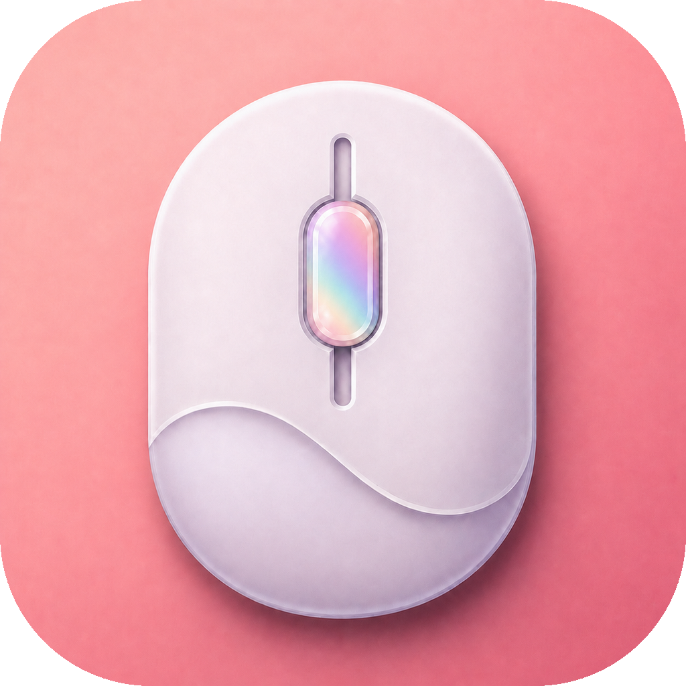

<!-- SPDX-License-Identifier: CC-BY-SA-4.0 -->
<p align="center">
  
</p>

<h1 align="center">Mira</h1>

<p align="center">
  A modern, quiet, plugin-driven mouse settings client.
</p>

<p align="center">
  <a href="README.md">中文</a> ·
  <a href="#highlights">Highlights</a> ·
  <a href="#quick-start">Quick Start</a> ·
  <a href="#plugin-model">Plugin Model</a> ·
  <a href="#development">Development</a>
</p>

<p align="center">
  
  
  
  
</p>

## Overview

Mira is an unofficial, privacy-respecting mouse settings client for macOS, Windows, and Linux.

Device protocols live in signed declarative `.mira-plugin` packages. The host app owns the stable UI shell, permission boundary, HID access, theming, settings, diagnostics, and updates.

Plugins can declare devices, protocol commands, parsers, workflows, capabilities, and bounded writes. They cannot execute native code, scripts, remote web content, or arbitrary WASM. The UI is rendered from plugin-declared capabilities instead of brand-specific hardcoding.

## Highlights

- **Plugin-driven device support**: matching, protocol, parsing, capability metadata, and write surfaces are declared by plugins.
- **Bounded writes**: mutations declare input limits, pre-read state, preservation strategy, and readback assertions.
- **Privacy first**: no telemetry, accounts, ads, or resident network service.
- **Cross-platform desktop**: Tauri 2 + React 19, targeting DMG, NSIS, AppImage, Deb, and RPM.
- **Auditable plugin packages**: lock-file hashes, signature checks, and bundle policy.
- **Consistent host UI**: status, DPI, lighting, configuration, and diagnostics are rendered from stable host controls.

## Status

Mira is pre-release. Frontend, runtime, plugin loading, declarative protocol execution, and tests are in place, but device compatibility must follow hardware evidence and locked plugin packages.

Bundled resources currently include:

| Plugin | Purpose | Status |
|---|---|---|
| `mira.amaster` | AMaster / Angry Miao compatible devices, Protocol A and AM35 research path | Hardware verification in progress, bundled by default |
| `mira.logitech-hidpp` | Logitech HID++ 2.0 feature discovery, DPI, report rate, profiles, and lighting capability reads | Hardware verification in progress, bundled by default |
| `mira.example-mock` | Runtime and UI sample plugin | Test-only, not bundled by default |

Mira is not authorized, endorsed, or sponsored by any device manufacturer. Manufacturer names are used only to describe compatibility research.

## Quick Start

```bash
npm install
npm run typecheck
npm test -- --run
npm run build
```

Development preview:

```bash
npm run dev
```

Desktop development path:

```bash
npm exec tauri dev
```

Vite runs on `http://localhost:1420`; Tauri configuration lives in [`src-tauri/tauri.conf.json`](src-tauri/tauri.conf.json).

## Plugin Model

Mira follows one rule: **protocols belong to plugins; the interface belongs to the host app.**

The plugin repository is [`hello-yunshu/mira-mouse-plugins`](https://github.com/hello-yunshu/mira-mouse-plugins). Plugins are locked through [`plugins.lock.json`](plugins.lock.json), including version, asset name, SHA-256, publisher key, bundle policy, and resource path.

Useful docs:

- [Plugin package format](docs/plugin-package-format.md)
- [Plugin SDK](docs/plugin-sdk.md)
- [Protocol DSL](docs/protocol-dsl.md)
- [Plugin security](docs/plugin-security.md)
- [Plugin adaptation roadmap](docs/plugin-adaptation-roadmap.md)

## Project Structure

```text
src/                         React frontend, theme, i18n, device UI
src-tauri/                   Tauri shell, system integration, plugin resources
crates/mira-plugin-runtime/  Declarative protocol runtime
crates/mira-plugin-api/      Plugin API types
crates/mira-core/            Shared core types
docs/                        Security, plugins, release, adaptation, verification
schemas/                     Structured config schemas
scripts/                     Validation, icon, packaging helpers
```

## Development

```bash
npm run lint
npm run typecheck
npm test -- --run
npm run build
npm run check:boundaries
npm run check:structured
cargo test
```

For plugin runtime or HID changes:

```bash
cargo run -p mira-plugin-runtime --example enumerate_hid
```

For plugin repository changes:

```bash
npm run validate
npm test
```

## Release and Security

Community downloads use stable names and are published on [GitHub Releases](https://github.com/hello-yunshu/mira-mouse/releases):

- macOS: `Mira_macOS_<version>_universal.dmg`
- Windows: `Mira_Windows_<version>_x64-setup.exe`
- Linux: `Mira_Linux_<version>_amd64.AppImage`

### macOS install

Homebrew is recommended:

```bash
brew tap hello-yunshu/mira
brew install --cask mira
```

Direct DMG download is also supported. See [macOS install notes](docs/install-macos.md) and [Homebrew install notes](docs/install-homebrew.md).

Unsigned community packages trigger Gatekeeper or SmartScreen warnings; releases ship with SHA-256 checksums. See:

- [Unsigned release security](docs/unsigned-release-security.md)
- [Zero-cost release guide](docs/zero-cost-release.md)
- [Threat model](docs/threat-model.md)
- [Security policy](SECURITY.md)

## License

Code and build definitions are licensed under AGPL-3.0-or-later. Original documentation and non-trademark visual material are licensed under CC-BY-SA-4.0. See [`LICENSE`](LICENSE), [`NOTICE`](NOTICE), and [`THIRD_PARTY_NOTICES.md`](THIRD_PARTY_NOTICES.md).
